# Домашнее задание к занятию «Уязвимости и атаки на информационные системы». Шелухин Юрий

### Задание 1

1. Скачайте и установите виртуальную машину Metasploitable: https://sourceforge.net/projects/metasploitable/. Это типовая ОС для экспериментов в области информационной безопасности, с которой следует начать при анализе уязвимостей.  
2. Просканируйте эту виртуальную машину, используя **nmap**. Попробуйте найти уязвимости, которым подвержена эта виртуальная машина.  
Сами уязвимости можно поискать на сайте https://www.exploit-db.com/.  Для этого нужно в поиске ввести название сетевой службы, обнаруженной на атакуемой машине, и выбрать подходящие по версии уязвимости.  
3. Ответьте на следующие вопросы:  
- Какие сетевые службы в ней разрешены?  
- Какие уязвимости были вами обнаружены? (список со ссылками: достаточно трёх уязвимостей)  
*Приведите ответ в свободной форме.*    

**Решение**

1. Запустим виртуальную машину Metasploitable посредством VMware Workstation. Запустим и найдем её сетевой адрес.  

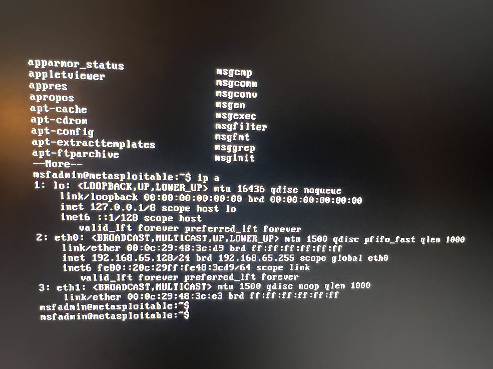  

Проверим ping к Metasploitable.

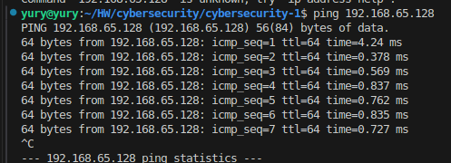

**2-3.** Установим Nmap. Применим агрессивный режим сканирования хоста Metasploitable.  
`nmap -A 192.168.65.128`

Получим результат.

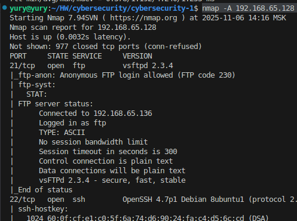  

Найдено несколько разрешенных сетевых служб.

-21/tcp - FTP (vsftpd 2.3.4);

-22/tcp - SSH (OpenSSH 4.7p1);

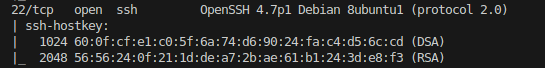

-23/tcp - Telnet;

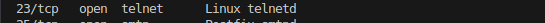

-25/tcp - SMTP (Postfix);

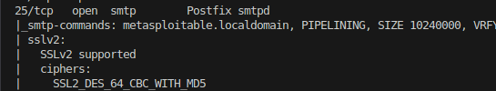

-53/tcp - DNS (ISC BIND 9.4.2).

Проверим уязвимости с использованием сайта https://www.exploit-db.com/ и другой информации в сети.  

`FTP (vsftpd 2.3.4)` -  backdoor, разрешен доступ анонимному пользователю.

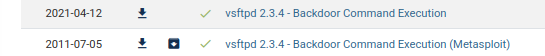

`OpenSSH 4.7p1 Debian 8ubuntu1 (protocol 2.0)` - устаревшая на несколько поколений версия. Риск: Weak keys, brute force атаки.

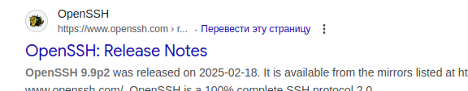

`Telnet` - Незашифрованное соединение, возможен перехват учетных данных

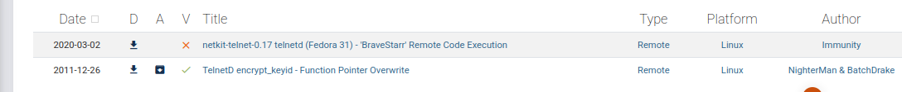  

`SMTP (Postfix)` - SSLv2 поддержка (устаревшая и небезопасная) перебор пользователей, brute force.
 

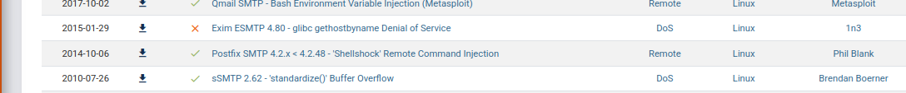 

`DNS (ISC BIND 9.4.2)` - может раскрывать информацию о сети.

Самая большая уязdимость - `Bind Shell (port 1524)`. Выявлен открытый bindshell от root. Прямой root доступ без аутентификации.

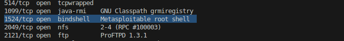 

---

### Задание 2.

Проведите сканирование Metasploitable в режимах SYN, FIN, Xmas, UDP. Запишите сеансы сканирования в Wireshark.  
Ответьте на следующие вопросы:  
- Чем отличаются эти режимы сканирования с точки зрения сетевого трафика?  
- Как отвечает сервер?   
*Приведите ответ в свободной форме.*  

**Решение**

Установим wireshark. Проведем сканирование в режимах:  

-syn  

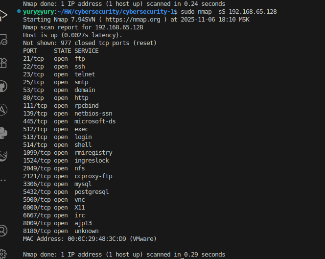     
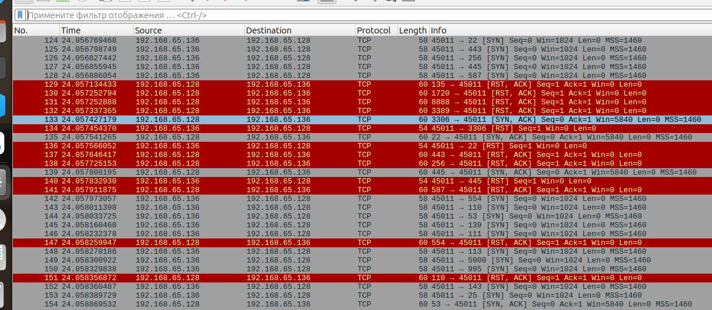   

Этот метод дает картину реально доступных сетевых служб без установления полных соединений. Направляется SYN пакет. Ответы SYN указывают на то, что порт прослушивается (открыт), а RST (сброс) на то, что не прослушивается. Если после нескольких запросов не приходит никакого ответа, то порт помечается как фильтруемый. Также помечается как фильтруемый, когда в ответ приходит ICMP сообщение об ошибке.  

-FIN  

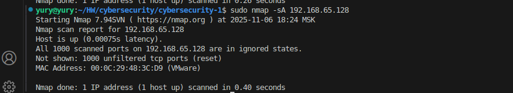   
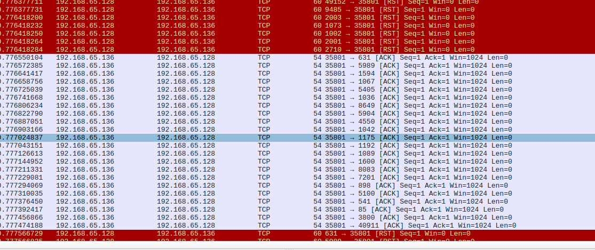      

Этот метод НЕ определяет открытые/закрытые порты, а только Фильтруется ли порт firewall'ом и доступен ли порт для подключения. Для получения информации направляется SYN-ACK пакет. Ответ RST - порт доступен. Нет ответа или ошибка- порт фильтруется.  

-Xmas

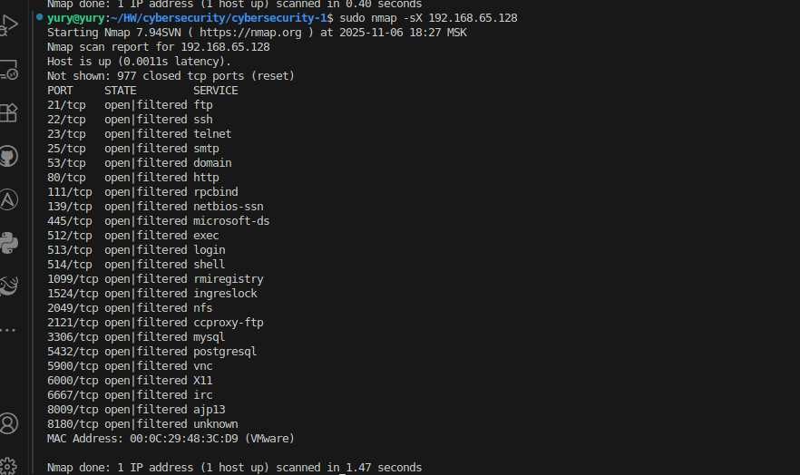   
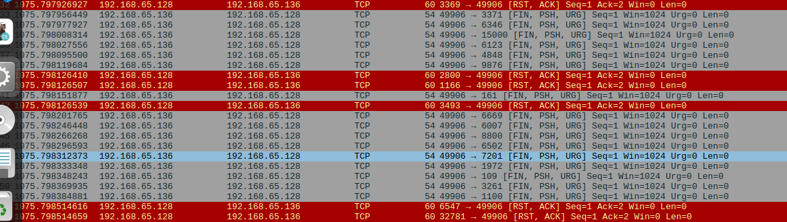      

Оправляемые флаги FIN + URG + PSH (все сразу).  Ответ RST/ACK - порт закрыт. Нет ответа - порт открыт ИЛИ фильтруется. ICMP ошибка - порт фильтруется. Xmas scan полезен для первоначальной разведки через строгие firewall'ы, тестирования IDS/IPS систем, скрытного сканирования UNIX-систем.  

-UDP   

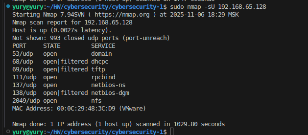  
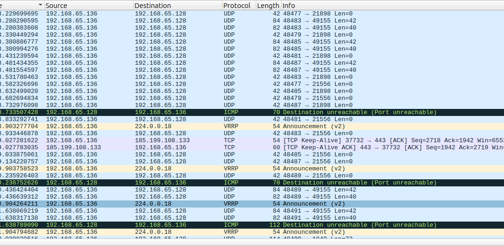  

Работает путем посылки пустого (без данных) UDP заголовка на каждый целевой порт. Обнаруживает UDP службы (невидимые для TCP сканирования), находит уязвимости в DNS, SNMP, TFTP. Определяет реально работающие UDP сервисы.  Если в ответ приходит ICMP ошибка о недостижимости порта (тип 3, код 3), значит порт закрыт.  Другие ICMP ошибки недостижимости (тип 3, коды 1, 2, 9, 10 или 13) указывают на то, что порт фильтруется. Иногда, служба будет отвечать UDP пакетом, указывая на то, что порт открыт. Если после нескольких попыток не было получено никакого ответа, то порт классифицируется как открыт|фильтруется. Это означает, что порт может быть открыт, или, возможно, пакетный фильтр блокирует его. Работает медленно - в моем случае больше 15 минут. 

--- 

